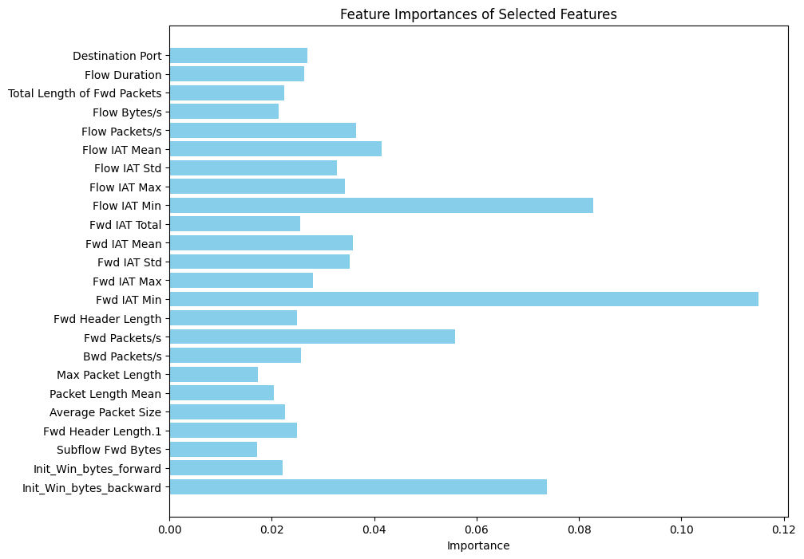

# IoT Botnet DDoS Detection using Simple RandomClassifier

This project is aimed at detecting web attacks using a Random Forest classifier. The dataset used is from the "Thursday-WorkingHours-Morning-WebAttacks.pcap_ISCX.csv" file, which contains network traffic data with labeled instances of normal and attack traffic.

## Table of Contents

- [Overview](#overview)
- [Installation](#installation)
- [Usage](#usage)
- [Features](#features)
- [Visualization](#visualization)
- [Output](#output)
- [Contributing](#contributing)
- [License](#license)

## Overview

The code performs the following tasks:

1. **Data Preprocessing**: Cleans the dataset by handling missing values and encoding the target labels.
2. **Feature Selection**: Identifies the most important features using the `SelectFromModel` method.
3. **Model Training**: Trains a Random Forest classifier on the selected features.
4. **Model Evaluation**: Evaluates the model's performance on a test set, providing accuracy and a classification report.
5. **Feature Visualization**: Visualizes the importance of the selected features using a bar chart.

## Installation

1. **Clone the repository**:
    ```bash
    git clone https://github.com/Ram001-code/IoT-Botnet-DDoS.git
    cd IoT-Botnet-DDoS
    ```

2. **Install the necessary Python packages**:
    ```bash
    pip install pandas numpy scikit-learn matplotlib
    ```

3. **Place the dataset** (`Thursday-WorkingHours-Morning-WebAttacks.pcap_ISCX.csv`) in the project directory.

## Usage

To run the script, simply upload the dataset `Thursday-WorkingHours-Morning-WebAttacks.pcap_ISCX.csv` and `RandomForestIotDDoSDetection.ipynb` file in Google Colab and run them Accordingly.
This will load the dataset, process it, train the Random Forest model, and display the feature importance visualization along with the model's accuracy and classification report.

## Features

- **Data Preprocessing**: The code handles missing values and encodes categorical labels for machine learning.
- **Feature Selection**: Automatically selects the most important features using a Random Forest model.
- **Model Training**: Trains a Random Forest model using the selected features.
- **Model Evaluation**: Provides accuracy, precision, recall, and F1-score for the trained model.
- **Feature Visualization**: Visualizes the importance of the selected features using a bar chart.

## Visualization

The code includes a visualization step that displays the importance of the selected features in the form of a bar chart. This helps in understanding which features contribute the most to the model's predictions.

Example of the feature importance visualization:



## Output

Upon running the script, the following output will be provided:

- **Selected Features**: A list of the most important features selected by the model.
- **Feature Importance Visualization**: A bar chart showing the importance of each selected feature.
- **Model Accuracy**: The accuracy of the model on the test data.
- **Classification Report**: Precision, recall, F1-score, and support for each class in the dataset.
